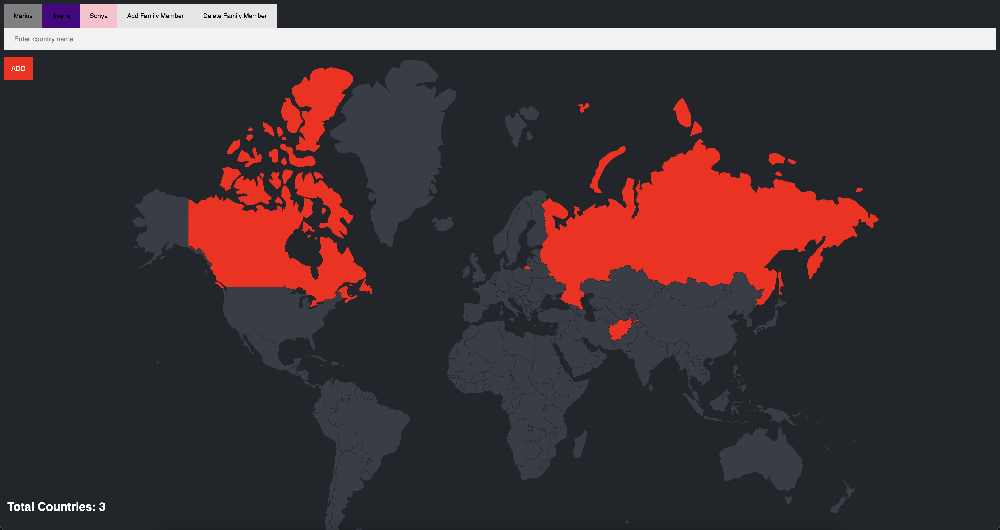

# Family Travel Tracker

[](#)
> A web application that allows users to log and visualize visited countries with personalized colors. Users can add or delete profiles, and all data is stored in a MySQL database.

## Overview

**Family Travel Tracker ** provides an interactive way for users to track their travel history by marking countries on a world map. The app stores user data in a secure MySQL database, enabling users to add and delete profiles and maintain a log of visited locations.


## Preview

<p align="center">
  
</p>

## Features

- **Interactive Map:** Users can visualize and track visited countries.
- **User Profiles:** Each user can create a profile and manage their travel logs.
- **Data Persistence:** Travel data is securely stored in a MySQL database.
- **Dynamic UI:** Built with **EJS**, allowing dynamic content rendering.

## Live Demo

**Explore the live version here:** [View Live Demo](https://marius-bogdan.com/projects/family-travel-tracker/)

## Local Setup

1. **Clone** the repository:
   ```bash
   git clone https://github.com/MIBogdan/family-travel-tracker.git
   ```
2. **Import the database:** 
- Import the `world` file into MySQL. This will automatically create the `world` database and populate it with the necessary data.


3. **Ensure your MySQL credentials match the following** (as used in `index.js`):
- **Username**: `root`
- **Host**: `localhost`
- **Database**: `world`
- **Password**: (leave empty if not set)


4. **Install** dependencies:
   ```bash
   npm install
   ```

5. **Run** the application:
   ```bash
   npm start
   ```
- The development server will open automatically in your default browser.
- **If it doesn't open automatically**,manually visit: http://localhost:3000 in your browser.

6. **Terminate** the server:
- **On macOS/Linux:** Press `Control + C` in the terminal. 
- **On Windows:** Press `Ctrl + C` in the Command Prompt or PowerShell. 
---

## Author

**Marius Bogdan**  
[Personal portfolio](https://marius-bogdan.com/)

Feel free to reach out for any questions or collaborations!

## License

This project is provided for testing and demonstration purposes only. All rights are reserved. No part of this project may be redistributed, reuploaded, or used in any manner (commercially or otherwise) without explicit written permission from the author.
